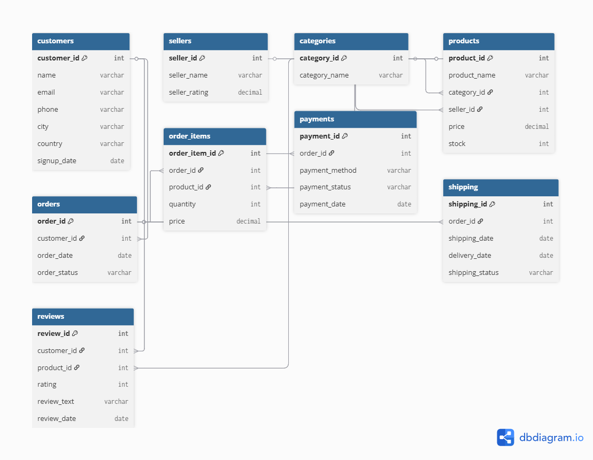

# E-Commerce SQL Database Project

## Project Overview
This project demonstrates a simplified e-commerce database system built using SQL.  
The database simulates how an online shopping platform manages customers, products, orders, payments, shipping, and reviews.

The goal of this project is to analyze sales performance and customer behavior using SQL queries.

---

## Database Tables
The database contains the following tables:

- customers
- sellers
- categories
- products
- orders
- order_items
- payments
- shipping
- reviews

These tables are connected using **Primary Keys** and **Foreign Key relationships**.

---

## Dataset
The project uses **sample e-commerce data inserted through SQL scripts**.  
The dataset simulates real-world data including customers, sellers, products, orders, payments, and reviews.

---

## Skills Used
- SQL database design
- Primary Key and Foreign Key relationships
- SQL joins
- Aggregation queries
- Business data analysis

---

## Business Questions
The SQL queries in this project answer important business questions such as:

1. What are the top selling products?
2. Which customers spend the most money?
3. Which product categories generate the highest sales?
4. What is the monthly revenue trend?
5. Which sellers have the best performance?

---

## ER Diagram

---

## Example Analytics Queries

Some example queries included in this project:

- Top selling products
- Total revenue calculation
- Best customers by spending
- Sales by category
- Monthly sales trend

---

## Project Structure

ecommerce-sql-project  
│  
├── schema.sql  
├── insert_data.sql  
├── analytics_queries.sql  
├── README.md  
└── er_diagram.png  

---

## How to Run the Project

1. Run the **schema.sql** file to create the database tables.
2. Run the **insert_data.sql** file to insert sample data.
3. Execute the queries in **analytics_queries.sql** to perform analysis.

---

## Conclusion

This project demonstrates how SQL can be used to design relational databases and perform business analysis on e-commerce data.
